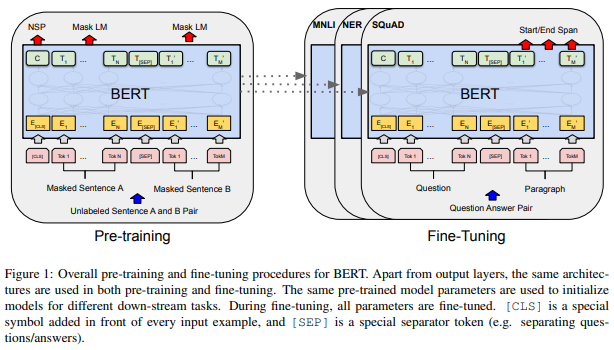
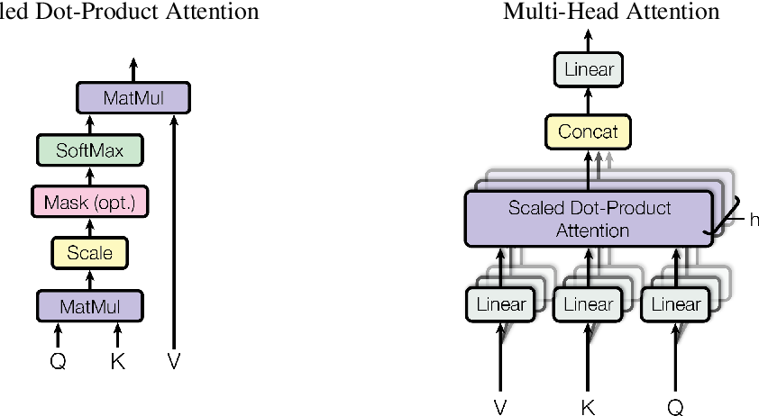

<p align="center">
  
  
  
  
  
</p>

<h1 align="center">BERT — From Scratch in PyTorch</h1>

<p align="center">
  <b>A faithful, from-scratch PyTorch implementation of the original BERT paper</b><br>
  <i>"Pre-training of Deep Bidirectional Transformers for Language Understanding"</i>
</p>

<p align="center">
  <a href="https://arxiv.org/abs/1810.04805">Read the Paper</a> •
  <a href="#-architecture">Architecture</a> •
  <a href="#-training">Training</a> •
  <a href="#-results">Results</a> •
  <a href="#-inference">Inference</a>
</p>

---

## Project Overview

**BERT (Bidirectional Encoder Representations from Transformers)** revolutionized natural language processing by introducing deep bidirectional pre-training for language representations. Unlike previous models that read text sequentially (left-to-right or right-to-left), BERT reads the **entire sequence simultaneously**, allowing it to understand context from both directions.

This project is a **complete, from-scratch implementation** of the BERT-Base architecture in PyTorch — no pre-built transformer libraries, no shortcuts. Every component, from the multi-head self-attention mechanism to the masked language modeling head, is hand-built to faithfully reproduce the original paper's design.

### Why This Project Matters

| | |
|---|---|
| **Deep Understanding** | Building BERT from scratch demonstrates mastery of transformer internals, attention mechanisms, and modern NLP architectures |
| **Engineering Rigor** | Clean, modular code with proper weight initialization, gradient accumulation, mixed-precision training, and dual-optimizer scheduling |
| **Paper-Faithful** | The implementation mirrors the original paper's architecture, including weight tying, GELU activations, and the paper-accurate pooler + MLM head design |
| **Fully Trained** | Pre-trained for 30 epochs with real training logs, checkpointing, and evaluation — not just a skeleton |

### What You'll Find Here

- A **110M-parameter** BERT-Base model built entirely from `nn.Module` primitives
- A custom **Muon optimizer** (Newton-Schulz orthogonalization) paired with AdamW in a dual-optimizer setup
- Complete **data pipeline** with NSP sampling, MLM masking (80/10/10 strategy), and dynamic padding
- **Interactive inference** for both Masked Language Modeling and Next Sentence Prediction
- Mixed-precision training with gradient accumulation and linear warmup scheduling

---

## Paper Information

| | |
|---|---|
| **Title** | *BERT: Pre-training of Deep Bidirectional Transformers for Language Understanding* |
| **Authors** | Jacob Devlin, Ming-Wei Chang, Kenton Lee, Kristina Toutanova |
| **Published** | 2018 (Google AI Language) |
| **Link** | [arXiv:1810.04805](https://arxiv.org/abs/1810.04805) |

---

## Architecture

The implementation follows the **BERT-Base** configuration exactly:

| Hyperparameter | Value | Description |
|---|---|---|
| Hidden Size (d_model) | 768 | Dimensionality of token representations |
| Attention Heads | 12 | Parallel attention computations per layer |
| Head Dimension (d_k) | 64 | 768 ÷ 12 = 64 per head |
| Encoder Layers | 12 | Depth of the transformer stack |
| Feed-Forward Size | 3,072 | Intermediate FFN dimension (4 × 768) |
| Max Sequence Length | 512 | Maximum input tokens |
| Vocabulary Size | 30,522 | WordPiece tokenizer vocab |
| Total Parameters | **110,106,428** | Trainable parameters |
| Dropout | 0.1 | Applied to attention and FFN outputs |
| Activation | GELU | Gaussian Error Linear Unit |

### Architecture Diagram

<!-- Replace with your own architecture figure if available -->


```
                          Input Tokens
                               │
                               ▼
              ┌─────────────────────────────────────────────┐
              │              EMBEDDING LAYER                │
              │                                             │
              │   Token Embeddings    (30,522 × 768)        │
              │ + Segment Embeddings  (2 × 768)             │
              │ + Position Embeddings (512 × 768)           │
              │                                             │
              │   → LayerNorm → Dropout(0.1)                │
              └──────────────────┬──────────────────────────┘
                                 │
                                 ▼
              ┌─────────────────────────────────────────────┐
              │                                             │
              │       TRANSFORMER ENCODER  ×  12            │
              │                                             │
              │  ┌───────────────────────────────────────┐  │
              │  │   Multi-Head Self-Attention            │  │
              │  │   12 heads × (Q·Kᵀ/√64) · V          │  │
              │  │   → Concat → Linear(768→768)          │  │
              │  └──────────────┬─────────────────────···┘  │
              │                 │                            │
              │      Residual + LayerNorm                   │
              │                 │                            │
              │  ┌──────────────▼────────────────────────┐  │
              │  │   Position-wise Feed-Forward           │  │
              │  │   Linear(768→3072) → GELU             │  │
              │  │   Linear(3072→768)                     │  │
              │  └──────────────┬────────────────────────┘  │
              │                 │                            │
              │      Residual + LayerNorm                   │
              │                                             │
              └──────────────────┬──────────────────────────┘
                                 │
                    ┌────────────┴────────────┐
                    ▼                         ▼
           ┌──────────────────┐     ┌──────────────────┐
           │    MLM Head      │     │    NSP Head       │
           │                  │     │                   │
           │  Dense(768→768)  │     │  [CLS] pooling    │
           │  → GELU          │     │  Dense(768→768)   │
           │  → LayerNorm     │     │  → Tanh           │
           │  → Projection    │     │  → Linear(768→2)  │
           │  (weight-tied    │     │                   │
           │   with Token     │     │  Output: IsNext / │
           │   Embeddings)    │     │          NotNext   │
           │                  │     │                   │
           │  Output: vocab   │     │                   │
           │  probabilities   │     │                   │
           └──────────────────┘     └──────────────────┘
```

> **Figure:** Complete BERT-Base architecture as implemented in this project. The MLM head uses **weight tying** with the input token embeddings (following the original paper), and the NSP head operates on the pooled `[CLS]` token representation through a tanh-activated dense layer (the "pooler").

---

## Features

### Core Components (Paper-Faithful)
| Component | Implementation Detail |
|---|---|
| **Token Embeddings** | `nn.Embedding(30522, 768)` — WordPiece subword tokenization |
| **Segment Embeddings** | `nn.Embedding(2, 768)` — Distinguishes Sentence A from B |
| **Position Embeddings** | `nn.Embedding(512, 768)` — Learned absolute positions |
| **Multi-Head Attention** | 12 heads, scaled dot-product with dtype-aware masking |
| **Feed-Forward Network** | 768 → 3072 → 768 with GELU activation |
| **Layer Normalization** | Post-norm residual pattern on each sub-layer |
| **MLM Head** | Dense → GELU → LayerNorm → weight-tied projection |
| **NSP Head** | [CLS] → Dense → Tanh pooler → binary classifier |
| **Weight Initialization** | All parameters from N(0, 0.02) per the paper |

### Training Infrastructure
| Feature | Detail |
|---|---|
| **Mixed Precision** | FP16 via `torch.amp.GradScaler` with safe NaN-aware stepping |
| **Gradient Accumulation** | 4 steps → effective batch size of 32 |
| **Gradient Clipping** | Max norm = 5.0 for training stability |
| **Dual Optimizer** | Muon (embeddings) + AdamW (everything else) |
| **LR Scheduling** | Linear warmup (10% steps) + linear decay |
| **Checkpointing** | Full state: model, both optimizers, both schedulers, metrics |
| **Reproducibility** | Seeded RNG across Python, NumPy, and CUDA |

### Configurable Hyperparameters
```python
VOCAB_SIZE      = 30_522     # WordPiece vocabulary
EMBED_SIZE      = 768        # Hidden dimension
NUM_HEADS       = 12         # Attention heads
HIDDEN_SIZE     = 3_072      # FFN intermediate size
NUM_LAYERS      = 12         # Transformer layers
MAX_SEQ_LENGTH  = 512        # Maximum sequence length
DROPOUT         = 0.1        # Dropout probability
BATCH_SIZE      = 8          # Per-step batch size
GRADIENT_ACCUMULATION_STEPS = 4  # Effective batch = 32
```

---

## Project Structure

```
BERT/
│
├── model.py           # BERT model — pooler, MLM head, NSP head, weight init, optimizer config
├── encoder.py         # Core building blocks — EmbeddingLayer, Multi-Head Attention, EncoderLayer
├── data.py            # BERTDataset — NSP pair sampling, MLM masking (80/10/10), collation
├── train.py           # Training loop — mixed precision, gradient accumulation, evaluation, checkpointing
├── inference.py       # Interactive inference — MLM fill-in-the-blank & NSP sentence pair classification
├── optim.py           # Muon optimizer — Newton-Schulz orthogonalization for embedding updates
│
├── assets/            # Architecture diagrams and figures from the paper
│   ├── bert_architecture.png
│   ├── attention.png
│   └── MLM_NSP.jpg
│
├── .gitignore         # Git ignore rules for checkpoints, caches, and artifacts
├── LICENSE            # MIT License
└── README.md          # Project documentation
```

---

## Installation

### Prerequisites

| Requirement | Minimum |
|---|---|
| Python | 3.9+ |
| PyTorch | 2.0+ |
| GPU | NVIDIA with 8GB+ VRAM (recommended) |
| CUDA | 11.8+ (for GPU training) |

### Setup

```bash
# 1. Clone the repository
git clone https://github.com/yourusername/BERT-from-scratch.git
cd BERT-from-scratch

# 2. Install PyTorch (CUDA 12.1)
pip install torch torchvision torchaudio --index-url https://download.pytorch.org/whl/cu121

# 3. Install remaining dependencies
pip install transformers numpy matplotlib
```

<details>
<summary><b>CPU-Only Installation</b></summary>

```bash
pip install torch torchvision torchaudio --index-url https://download.pytorch.org/whl/cpu
pip install transformers numpy matplotlib
```

> Training BERT-Base on CPU is extremely slow and not recommended. Use a GPU for any meaningful training.

</details>

---

## Training

### How the Pipeline Works

```
  ┌─────────────┐    ┌──────────────┐    ┌──────────────────┐    ┌──────────────┐
  │  Raw Text    │───▶│  Document    │───▶│  NSP Pair        │───▶│  MLM Masking │
  │  Corpus      │    │  Splitting   │    │  Sampling        │    │  (80/10/10)  │
  └─────────────┘    └──────────────┘    │  50% IsNext      │    └──────┬───────┘
                                          │  50% NotNext     │           │
                                          └──────────────────┘           ▼
                                                              ┌──────────────────┐
  ┌─────────────┐    ┌──────────────┐    ┌──────────────────┐ │  Tokenize +      │
  │  Backprop   │◀───│  BERT        │◀───│  Batch Collation │◀│  Truncate + Pad  │
  │  + Optimize │    │  Forward     │    │  + DataLoader    │ │  + Attention Mask │
  └─────────────┘    └──────────────┘    └──────────────────┘ └──────────────────┘
```

### Dataset Format

The model expects a text corpus with one sentence per line and blank lines separating documents:

```
This is the first sentence of document one.
This is the second sentence.

This is a new document.
Another sentence in this document.
```

### Training Command

```bash
python train.py
```

The training script will:
1. **Load** the corpus and split into 90/10 train/validation sets
2. **Initialize** the BERT-Base model (110,106,428 trainable parameters)
3. **Configure** dual optimizers (Muon + AdamW) with linear warmup scheduling
4. **Train** with automatic mixed precision and gradient accumulation
5. **Evaluate** on the validation set after every epoch
6. **Checkpoint** the full training state (model + optimizers + schedulers + metrics)

### Training Configuration

| Setting | Value | Notes |
|---|---|---|
| Epochs | 30 | Full convergence run |
| Batch Size | 8 | Per-step micro-batch |
| Effective Batch | 32 | 8 × 4 accumulation steps |
| Warmup Steps | 10% | Of total training steps |
| Muon LR | 0.02 | For embedding parameters |
| AdamW LR | 1e-4 | For all other parameters |
| AdamW Betas | (0.9, 0.999) | Standard Adam moments |
| Weight Decay | 0.01 | AdamW decoupled decay |
| Gradient Clip | 5.0 | Max gradient norm |
| Precision | FP16 | Automatic mixed precision |
| Seed | 131 | For reproducibility |

### Optimizer Deep-Dive: Muon + AdamW

This project uses a **dual-optimizer** strategy, which is a notable engineering choice:

- **Muon Optimizer** — Applied to 2D embedding matrices. Uses Newton-Schulz iteration (5 steps of a quintic polynomial) to approximate the orthogonal Procrustes solution, effectively normalizing gradient updates. This produces more stable embedding updates than standard SGD.

- **AdamW** — Applied to all other parameters (attention projections, FFN weights, biases, LayerNorm). Standard adaptive optimizer with decoupled weight decay.

```python
# Optimizer assignment logic (model.py)
for name, param in self.named_parameters():
    if param.dim() == 2 and "embedding" in name:
        muon_params.append(param)      # → Muon optimizer
    else:
        adamw_params.append(param)     # → AdamW optimizer
```

---

## Inference

The project includes an interactive inference script supporting both pre-training tasks:

```bash
python inference.py
```

You'll be prompted to select a mode:
```
Select inference mode:
  1. Masked Language Model (MLM)
  2. Next Sentence Prediction (NSP)
  3. Run both demos
```

### Masked Language Modeling (MLM)

Fill in `[MASK]` tokens with the model's top-k predictions:

```
MLM >>> The king [MASK] to the castle.

  [MASK] at position 3:
    1. went            0.3241  ██████████
    2. returned        0.1856  █████
    3. came            0.1203  ███
    4. rode            0.0892  ██
    5. traveled        0.0654  █
```

### Next Sentence Prediction (NSP)

Test whether the model thinks sentence B follows sentence A:

```
Sentence A >>> The sun was setting over the horizon.
Sentence B >>> Beautiful colors painted the sky.

  Prediction : IsNext
  Confidence : 0.8734
  P(IsNext)  : 0.8734
  P(NotNext) : 0.1266
```

---

## Model Components

### 1. Embedding Layer (`encoder.py`)

```python
class EmbeddingLayer(nn.Module):
    # Token Embedding:    nn.Embedding(30522, 768)  — WordPiece subwords
    # Segment Embedding:  nn.Embedding(2, 768)      — Sentence A (0) vs B (1)
    # Position Embedding: nn.Embedding(512, 768)     — Absolute position indices
    #
    # Output = LayerNorm(Token + Segment + Position) → Dropout(0.1)
```

The three embeddings are **summed element-wise** (as specified in the paper), then normalized and regularized before entering the encoder stack.

### 2. Multi-Head Self-Attention (`encoder.py`)

```python
class MHA(nn.Module):
    # 12 parallel attention heads, each operating on d_k = 64 dimensions
    #
    # Q, K, V = separate Linear(768 → 768) projections
    # Attention(Q, K, V) = softmax(Q·Kᵀ / √64) · V
    # Output = Linear(768 → 768)  — re-projection after head concatenation
```

Key implementation details:
- Attention mask uses `torch.finfo(scores.dtype).min` for **safe FP16 masking** (avoids hardcoded `-1e9` which overflows in half precision)
- Padding tokens are masked to prevent attention leakage

### 3. Encoder Layer (`encoder.py`)

```python
class EncoderLayer(nn.Module):
    # Sub-layer 1: x = LayerNorm(x + Dropout(MultiHeadAttention(x)))
    # Sub-layer 2: x = LayerNorm(x + Dropout(FeedForward(x)))
    #
    # FFN: Linear(768→3072) → GELU → Linear(3072→768)
```



Each encoder layer follows the **post-norm residual connection** pattern with **GELU activation** (not ReLU — an important distinction from the original Transformer paper).

### 4. MLM Head (`model.py`)

```python
# Paper-accurate MLM transform:
# h = GELU(Dense(encoder_output))     — 768 → 768 non-linear transform
# h = LayerNorm(h)                    — normalization
# logits = h @ Embedding.weight.T     — weight-tied projection (no extra params)
#        + learned_bias               — output bias term
```


**Weight tying** between the MLM output projection and the input token embedding matrix is a key paper design — it reduces parameters and creates a shared representation space.

### 5. NSP Head (`model.py`)

```python
# [CLS] token → Dense(768→768) → Tanh → Linear(768→2)
#
# The Tanh-activated dense layer is the "pooler" — it transforms the
# [CLS] representation into a fixed-size sentence representation
# suitable for binary classification.
```

### 6. Muon Optimizer (`optim.py`)

```python
# Newton-Schulz iteration (5 steps) for approximate matrix orthogonalization:
# X₀ = G / ‖G‖
# Xₖ₊₁ = Xₖ(aI + bXₖᵀXₖ + c(XₖᵀXₖ)²)
#
# Coefficients: a=3.4445, b=-4.7750, c=2.0315
# Produces quasi-orthogonal gradient updates for embedding matrices
```

---

## Results

Training results on the Tiny Shakespeare dataset over 30 epochs:

| Epoch | Train Loss | Val Loss | NSP Accuracy | Δ Train Loss |
|:---:|:---:|:---:|:---:|:---:|
| 1 | 8.8280 | 7.2684 | 63.62% | — |
| 5 | 6.3856 | 6.5044 | 74.27% | -2.4424 |
| 10 | 5.7723 | 5.9627 | 75.10% | -0.6133 |
| 15 | 5.2441 | 5.4624 | 77.32% | -0.5282 |
| 20 | 4.8296 | 5.2445 | 78.28% | -0.4145 |
| 25 | 4.3740 | 4.9617 | 80.36% | -0.4556 |
| 30 | 4.1367 | 4.5710 | 80.08% | -0.2373 |

### Training Highlights

| Metric | Value |
|---|---|
| **Total Parameters** | 110,106,428 |
| **Training Samples** | 6,499 |
| **Validation Samples** | 723 |
| **Final Train Loss** | 4.1367 |
| **Final Val Loss** | 4.5710 |
| **Best NSP Accuracy** | 80.36% (Epoch 25) |
| **Total Loss Reduction** | 8.83 → 4.14 (53% decrease) |
| **Device** | CUDA (GPU) |

> **Note:** This model was trained on a small corpus (~7K samples) for demonstration purposes. The original BERT was pre-trained on BooksCorpus (800M words) + English Wikipedia (2,500M words) for 1M+ steps on TPU pods. Despite the small dataset, the model shows clear learning: train loss drops by **53%** and NSP accuracy improves from **63.6% → 80.4%** (well above the 50% random baseline).

---

## Key Concepts from the Paper

### Bidirectional Context

Traditional language models process text in one direction:
- **GPT** → left-to-right (causal)
- **ELMo** → concatenation of left-to-right and right-to-left

BERT's key innovation is **deep bidirectional pre-training**: every token attends to every other token in the sequence simultaneously through self-attention. This produces richer contextual representations where each word's embedding is informed by the entire sentence.

### Masked Language Modeling (MLM)

To enable bidirectional training without information leakage, BERT randomly selects 15% of input tokens and applies the following strategy:

| Action | Probability | Purpose |
|---|---|---|
| Replace with `[MASK]` | 80% | Forces the model to learn contextual prediction |
| Replace with random token | 10% | Prevents the model from only learning `[MASK]` patterns |
| Keep unchanged | 10% | Biases representation toward actual observed tokens |

This is implemented in `data.py → BERTDataset._apply_mlm()`.

### Next Sentence Prediction (NSP)

BERT is additionally trained on a binary classification task:
- **50% positive pairs** — sentence B is the actual next sentence after A in the corpus
- **50% negative pairs** — sentence B is randomly sampled from a different document

This teaches the model to understand cross-sentence relationships, which is useful for downstream tasks like question answering and natural language inference.

### Fine-Tuning

After pre-training on MLM + NSP, the pre-trained encoder can be fine-tuned for downstream tasks by adding a simple task-specific head:

| Task | Head Architecture |
|---|---|
| Sentiment Analysis | `[CLS]` → Linear → Softmax |
| Named Entity Recognition | Token outputs → Linear → CRF |
| Question Answering | Token outputs → Linear(start, end) |
| Sentence Similarity | `[CLS]` → Linear → Sigmoid |

---

## Technologies Used

| Technology | Version | Purpose |
|---|---|---|
| **Python** | 3.9+ | Core language |
| **PyTorch** | 2.0+ | Deep learning framework — autograd, `nn.Module`, AMP |
| **Hugging Face Transformers** | latest | WordPiece tokenizer (`BertTokenizer`) and LR scheduling |
| **NumPy** | latest | Random seeding and data processing |
| **Matplotlib** | latest | Training curve visualization |
| **CUDA** | 11.8+ | GPU-accelerated training and inference |

---

## Future Improvements

- [ ] **RoBERTa-style Training** — Remove NSP objective, use dynamic masking, scale to larger batches
- [ ] **Mixed Precision Optimization** — BF16 support and per-layer precision control
- [ ] **Hugging Face Integration** — Export to `AutoModel` / `safetensors` format for ecosystem compatibility
- [ ] **Distributed Training** — Multi-GPU with `DistributedDataParallel` or FSDP
- [ ] **Large-Scale Pre-training** — BookCorpus + Wikipedia with streaming data pipeline
- [ ] **Fine-Tuning Scripts** — GLUE benchmark tasks (MRPC, SST-2, QQP, MNLI)
- [ ] **FlashAttention** — Memory-efficient attention for training on longer sequences
- [ ] **Tokenizer Training** — Custom BPE/WordPiece tokenizer instead of pre-trained vocabulary

---

## References

1. **BERT:** Devlin, J., Chang, M.W., Lee, K., & Toutanova, K. (2018). *BERT: Pre-training of Deep Bidirectional Transformers for Language Understanding.* [arXiv:1810.04805](https://arxiv.org/abs/1810.04805)

2. **Attention Is All You Need:** Vaswani, A., Shazeer, N., Parmar, N., et al. (2017). *Attention Is All You Need.* [arXiv:1706.03762](https://arxiv.org/abs/1706.03762)

3. **Muon Optimizer:** Jordan, K. (2024). *Muon: An optimizer for hidden layers in neural networks.* [GitHub](https://github.com/KellerJordan/Muon)

---

## License

This project is licensed under the MIT License — see the [LICENSE](LICENSE) file for details.

---

<p align="center">
  <b>Built from scratch with ❤️ and PyTorch</b><br>
  <i>If you find this useful, please consider giving it a ⭐</i>
</p>
